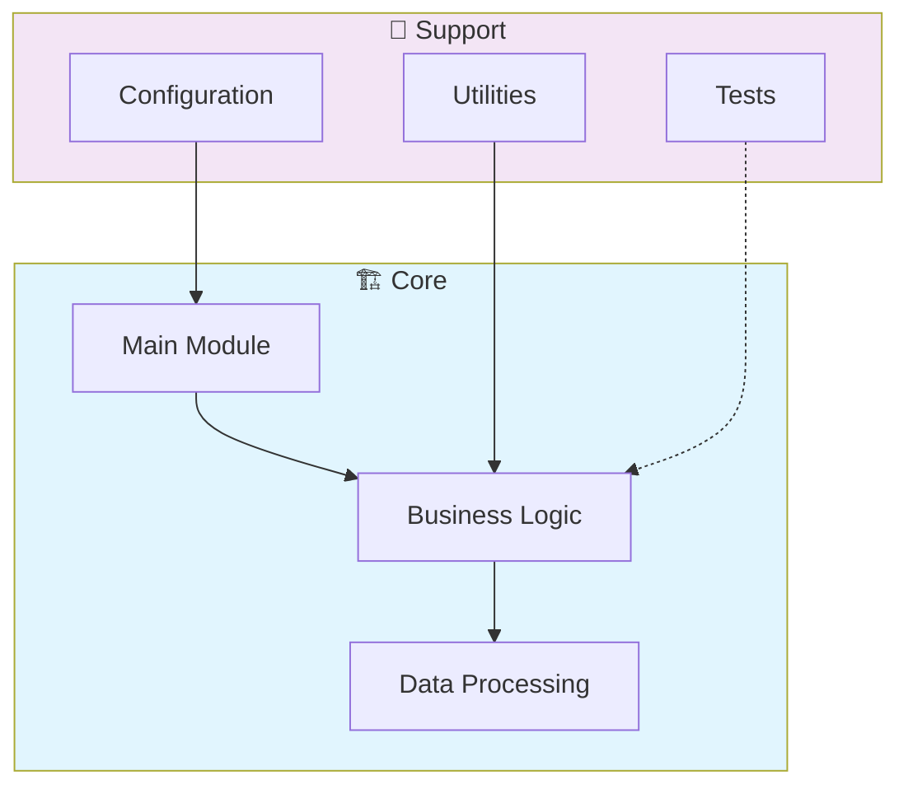

# 📊 Scala Spark Big Data

> Data Science project - scala-spark-big-data

[](https://img.shields.io/badge/)
[](LICENSE)

[English](#english) | [Português](#português)

---

## English

### 🎯 Overview

**Scala Spark Big Data** is a production-grade Scala application complemented by Shell that showcases modern software engineering practices including clean architecture, comprehensive testing, containerized deployment, and CI/CD readiness.

The codebase comprises **2,750 lines** of source code organized across **32 modules**, following industry best practices for maintainability, scalability, and code quality.

### ✨ Key Features

- **🔄 Data Pipeline**: Scalable ETL with parallel processing
- **✅ Data Validation**: Schema validation and quality checks
- **📊 Monitoring**: Pipeline health metrics and alerting
- **🔧 Configurability**: YAML/JSON-based pipeline configuration

### 🏗️ Architecture



### 🚀 Quick Start

#### Prerequisites

- Scala 3.3+
- sbt 1.9+
- Java 21+

#### Installation

```bash
# Clone the repository
git clone https://github.com/galafis/scala-spark-big-data.git
cd scala-spark-big-data

# Compile the project
sbt compile
```

#### Running

```bash
sbt run
```

### 🧪 Testing

```bash
sbt test
```

### 📁 Project Structure

```
scala-spark-big-data/
├── data/
│   └── sample/
│       └── README.txt
├── docker/
├── docs/          # Documentation
│   ├── architecture/
│   │   ├── system-architecture.md
│   │   └── system-design.md
│   └── architecture_diagram.md
├── images/
├── kubernetes/
│   └── spark/
│       └── spark-master.yaml
├── notebooks/
├── scripts/
│   └── deployment/
│       └── deploy-cluster.sh
├── src/          # Source code
│   ├── main/
│   │   ├── resources/
│   │   └── scala/
│   └── test/         # Test suite
│       └── scala/
├── terraform/
│   └── aws/
├── tests/         # Test suite
│   └── unit/
│       └── MainSpec.scala
├── CONTRIBUTING.md
├── LICENSE
├── README.md
└── README_EN.md
```

### 🛠️ Tech Stack

| Technology | Description | Role |
|------------|-------------|------|
| **Scala** | Core Language | Primary |
| Shell | 1 files | Supporting |

### 🤝 Contributing

Contributions are welcome! Please feel free to submit a Pull Request. For major changes, please open an issue first to discuss what you would like to change.

1. Fork the project
2. Create your feature branch (`git checkout -b feature/AmazingFeature`)
3. Commit your changes (`git commit -m 'Add some AmazingFeature'`)
4. Push to the branch (`git push origin feature/AmazingFeature`)
5. Open a Pull Request

### 📄 License

This project is licensed under the MIT License - see the [LICENSE](LICENSE) file for details.

### 👤 Author

**Gabriel Demetrios Lafis**
- GitHub: [@galafis](https://github.com/galafis)
- LinkedIn: [Gabriel Demetrios Lafis](https://linkedin.com/in/gabriel-demetrios-lafis)

---

## Português

### 🎯 Visão Geral

**Scala Spark Big Data** é uma aplicação Scala de nível profissional, complementada por Shell que demonstra práticas modernas de engenharia de software, incluindo arquitetura limpa, testes abrangentes, implantação containerizada e prontidão para CI/CD.

A base de código compreende **2,750 linhas** de código-fonte organizadas em **32 módulos**, seguindo as melhores práticas do setor para manutenibilidade, escalabilidade e qualidade de código.

### ✨ Funcionalidades Principais

- **🔄 Data Pipeline**: Scalable ETL with parallel processing
- **✅ Data Validation**: Schema validation and quality checks
- **📊 Monitoring**: Pipeline health metrics and alerting
- **🔧 Configurability**: YAML/JSON-based pipeline configuration

### 🏗️ Arquitetura


### 🚀 Início Rápido

#### Prerequisites

- Scala 3.3+
- sbt 1.9+
- Java 21+

#### Installation

```bash
# Clone the repository
git clone https://github.com/galafis/scala-spark-big-data.git
cd scala-spark-big-data

# Compile the project
sbt compile
```

#### Running

```bash
sbt run
```

### 🧪 Testing

```bash
sbt test
```

### 📁 Estrutura do Projeto

```
scala-spark-big-data/
├── data/
│   └── sample/
│       └── README.txt
├── docker/
├── docs/          # Documentation
│   ├── architecture/
│   │   ├── system-architecture.md
│   │   └── system-design.md
│   └── architecture_diagram.md
├── images/
├── kubernetes/
│   └── spark/
│       └── spark-master.yaml
├── notebooks/
├── scripts/
│   └── deployment/
│       └── deploy-cluster.sh
├── src/          # Source code
│   ├── main/
│   │   ├── resources/
│   │   └── scala/
│   └── test/         # Test suite
│       └── scala/
├── terraform/
│   └── aws/
├── tests/         # Test suite
│   └── unit/
│       └── MainSpec.scala
├── CONTRIBUTING.md
├── LICENSE
├── README.md
└── README_EN.md
```

### 🛠️ Stack Tecnológica

| Tecnologia | Descrição | Papel |
|------------|-----------|-------|
| **Scala** | Core Language | Primary |
| Shell | 1 files | Supporting |

### 🤝 Contribuindo

Contribuições são bem-vindas! Sinta-se à vontade para enviar um Pull Request.

### 📄 Licença

Este projeto está licenciado sob a Licença MIT - veja o arquivo [LICENSE](LICENSE) para detalhes.

### 👤 Autor

**Gabriel Demetrios Lafis**
- GitHub: [@galafis](https://github.com/galafis)
- LinkedIn: [Gabriel Demetrios Lafis](https://linkedin.com/in/gabriel-demetrios-lafis)
