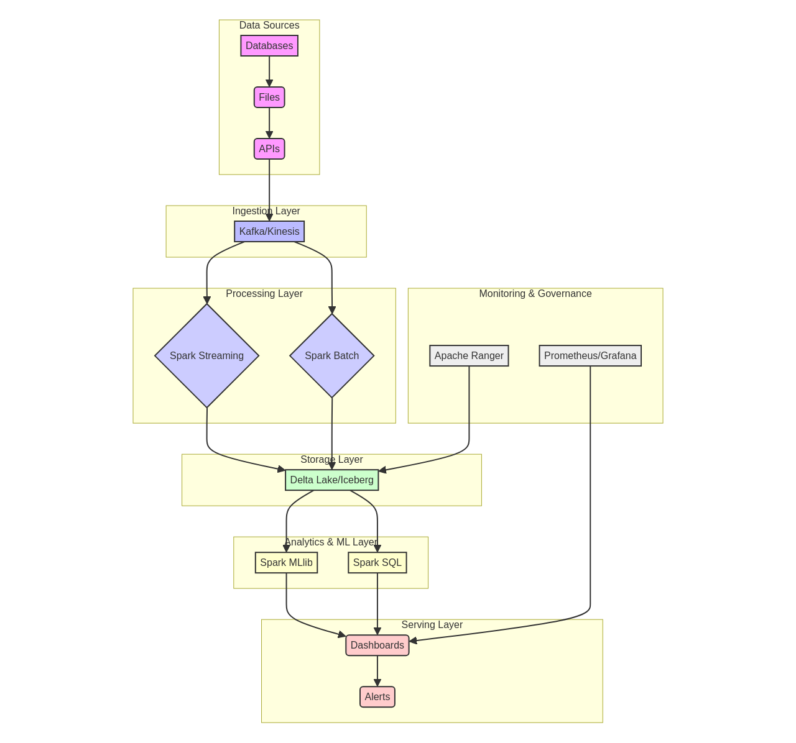

# Scala Spark Big Data


## 🇧🇷 Português

[](https://opensource.org/licenses/MIT)
[](https://www.scala-lang.org/)
[](https://spark.apache.org/)
[](https://www.scala-sbt.org/)

Este repositório apresenta um projeto de processamento de Big Data utilizando Scala e Apache Spark. O projeto demonstra a implementação de pipelines de ETL, análise de dados em lote e em tempo real, e a construção de modelos de machine learning para detecção de fraude e segmentação de clientes.

### Funcionalidades

*   **Processamento de Dados em Lote (Batch Processing)**: Ingestão, transformação e carregamento de grandes volumes de dados transacionais.
*   **Processamento de Dados em Tempo Real (Streaming Processing)**: Análise de fluxos de dados para detecção de anomalias e agregações em tempo real.
*   **Análise de Dados e Machine Learning**: Implementação de algoritmos de machine learning para detecção de fraude, segmentação de clientes, análise de séries temporais e análise de cesta de compras.
*   **Estrutura Modular**: Código organizado em módulos para facilitar a manutenção e escalabilidade.
*   **Configuração Flexível**: Utilização de arquivos de configuração para gerenciar parâmetros da aplicação e do Spark.

### Tecnologias Utilizadas

*   **Scala**: Linguagem de programação principal.
*   **Apache Spark**: Framework unificado para processamento de Big Data.
*   **Delta Lake**: Camada de armazenamento de dados para data lakes.
*   **sbt**: Ferramenta de construção para projetos Scala.
*   **Apache Hadoop (AWS S3)**: Integração com armazenamento em nuvem.
*   **Logback**: Sistema de logging.
*   **ScalaTest & Mockito**: Frameworks para testes unitários.

### Estrutura do Projeto

```
scala-spark-big-data/
├── src/
│   ├── main/
│   │   └── scala/com/galafis/bigdata/
│   │       ├── analytics/        # Lógica de análise e ML
│   │       ├── apps/             # Aplicações principais
│   │       ├── core/             # Componentes centrais
│   │       ├── etl/              # Pipelines de Extração, Transformação e Carga
│   │       ├── models/           # Definições de modelos de dados
│   │       ├── monitoring/       # Ferramentas de monitoramento
│   │       ├── storage/          # Camadas de abstração de armazenamento
│   │       ├── streaming/        # Lógica de processamento de streaming
│   │       └── utils/            # Funções utilitárias
├── tests/
│   ├── unit/             # Testes unitários
│   └── integration/      # Testes de integração
├── config/               # Arquivos de configuração da aplicação
├── data/                 # Dados de exemplo ou mock
├── docs/                 # Documentação adicional, diagramas
├── images/               # Imagens e elementos visuais
├── notebooks/            # Notebooks Jupyter/Zeppelin para exploração
├── project/              # Configurações do sbt
├── build.sbt             # Definições de build do sbt
├── README.md             # Este arquivo
├── README_EN.md          # Versão em inglês deste arquivo
├── LICENSE               # Licença do projeto
└── CONTRIBUTING.md       # Guia de contribuição
```

### Como Usar

#### Pré-requisitos

*   Java Development Kit (JDK) 8 ou superior
*   sbt (Scala Build Tool)
*   Apache Spark (para execução em cluster, opcional para `local[*]`) 

#### Construção do Projeto

Para construir o projeto, navegue até o diretório raiz e execute:

```bash
sbt clean compile
```

#### Execução dos Testes

Para executar os testes unitários e de integração:

```bash
sbt test
```

Para gerar o relatório de cobertura de código:

```bash
sbt coverageReport
```

#### Execução da Aplicação

O projeto pode ser executado em diferentes modos: `batch`, `streaming` ou `analytics`.

**Modo Batch:**

```bash
sbt "run batch"
```

**Modo Streaming:**

```bash
sbt "run streaming"
```

**Modo Analytics:**

```bash
sbt "run analytics"
```

### Diagrama de Arquitetura




### Contribuição

Contribuições são bem-vindas! Por favor, leia o `CONTRIBUTING.md` para detalhes sobre como submeter pull requests.

### Licença

Este projeto está licenciado sob a Licença MIT - veja o arquivo `LICENSE` para detalhes.

### Autor

**Gabriel Demetrios Lafis**

*   [GitHub](https://github.com/galafis)
*   [LinkedIn](https://www.linkedin.com/in/gabriel-demetrios-lafis/)

