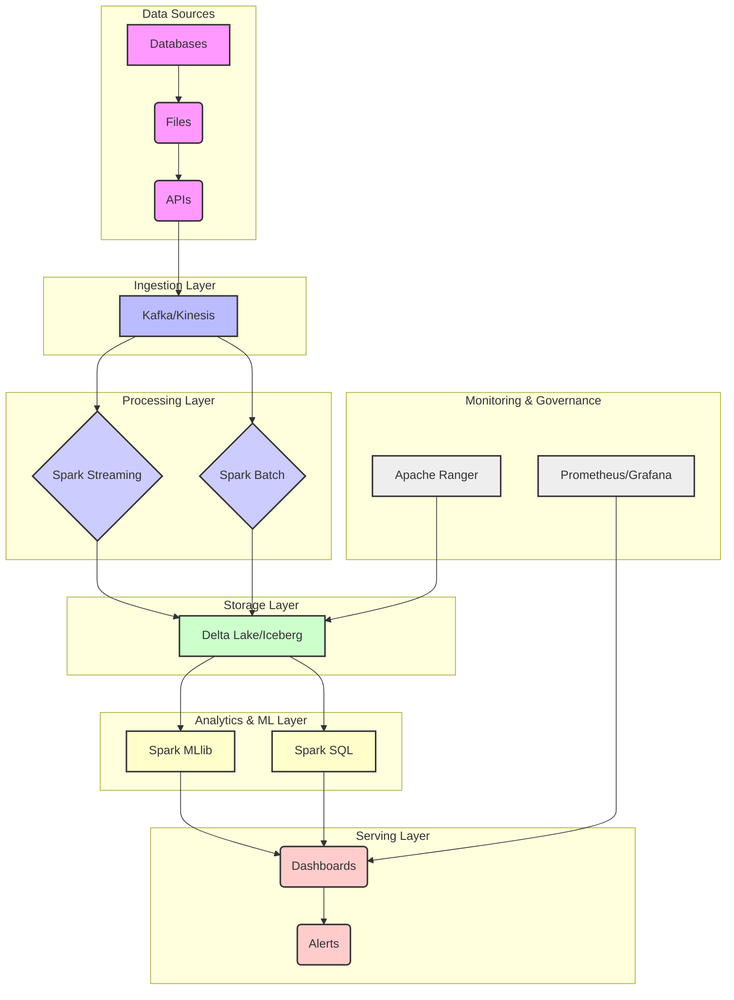

```mermaid
graph TD
    subgraph Data Sources
        A[Databases] --> B(Files)
        B --> C(APIs)
    end

    subgraph Ingestion Layer
        C --> D[Kafka/Kinesis]
    end

    subgraph Processing Layer
        D --> E{Spark Streaming}
        D --> F{Spark Batch}
    end

    subgraph Storage Layer
        E --> G[Delta Lake/Iceberg]
        F --> G
    end

    subgraph Analytics & ML Layer
        G --> H[Spark MLlib]
        G --> I[Spark SQL]
    end

    subgraph Serving Layer
        H --> J(Dashboards)
        I --> J
        J --> K(Alerts)
    end

    subgraph Monitoring & Governance
        L[Prometheus/Grafana] --> J
        M[Apache Ranger] --> G
    end

    style A fill:#f9f,stroke:#333,stroke-width:2px
    style B fill:#f9f,stroke:#333,stroke-width:2px
    style C fill:#f9f,stroke:#333,stroke-width:2px
    style D fill:#bbf,stroke:#333,stroke-width:2px
    style E fill:#ccf,stroke:#333,stroke-width:2px
    style F fill:#ccf,stroke:#333,stroke-width:2px
    style G fill:#cfc,stroke:#333,stroke-width:2px
    style H fill:#ffc,stroke:#333,stroke-width:2px
    style I fill:#ffc,stroke:#333,stroke-width:2px
    style J fill:#fcc,stroke:#333,stroke-width:2px
    style K fill:#fcc,stroke:#333,stroke-width:2px
    style L fill:#eee,stroke:#333,stroke-width:2px
    style M fill:#eee,stroke:#333,stroke-width:2px
```
